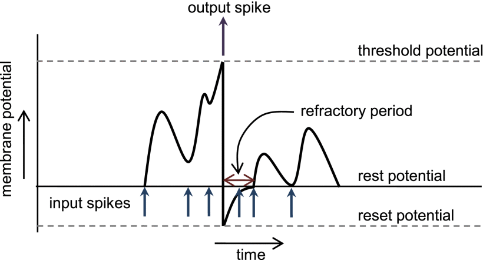

# Repository contents at this directory level
* ***data* folder**
  * This folder contains a local version of the MNIST dataset. The code uses this folder, so if its location is changed, the code has to be updated as well.  
* ***results* folder**
  * This folder contains two Microsoft Excel files:
    * ***execution_time.xlsx* file:**
      This file contains all the execution times (s) of all the phases of an epoch obtained from the different configurations tested. In addition, it can be also found the figures used in the presented paper. 
    * ***test_accuracies.xlsx* file:**
      This file contains all the accuracies (%) obtained from the different configurations tested. In addition, it can be also found the figures used in the presented paper.  

# Models files
The tested models were saved and they are available in a
[shared Google Drive folder](https://drive.google.com/drive/folders/11iJYIadVgx0wwGGEwb4PjgN8EWqKlVTm?usp=sharing) 
accessible to any UC3M email. If you need access and do not have such an account or it is simple not available, please contact me and I will send you the files. An example of how to load a model from the files can be found in the code.

The directory tree of the models folder is the following:

```bash
.
├── XN
    ├── XN_YBS_ZE_WF
        ├── WF
            ├── assignments.pt
            ├── network.pt
            └── proportions.pt
```
*X* represents the number of excitatory neurons of the model, *Y* the batch size, *Z* the number of epochs and *F* the fold. Remember that, as a 6-folds cross-validation procesdure is used, for each unique configuration, six independent models will be created, each one with its own files.

# Implemented code
The code has been thoroughly commented in order to point out those technical details that may seem strange at first sight. The base code can be found [here](https://github.com/BindsNET/bindsnet/blob/master/examples/mnist/batch_eth_mnist.py). Several topics that may be useful are discussed below.
## Execution instructions and possible arguments
For executing the code run the following line inside the *mnist_network* folder:
```bash
python3 mnist_snn.py [--ARGUMENT VALUE]*
```
*ARGUMENT* can be any of the following words:
Argument | Description | Default value |
:---     | :---        | :---:         |
seed | Used seed for random processes | 0
n_neurons | Number of excitatory neurons | 100
batch_size | Batch size | 32
n_test | Number of samples for test | 10,000 
n_train | Number of samples for training | 60,000 
n_workers | CPU threads to use | 0 (Automatic)
exc | Excitatory-Inhibitory connections weights | 22.5
inh | Inhibitory-Excitatory connections weights | 120
theta_plus | Adaptive threshold surplus addition after a spike (mV) | 0.05
time | Instances presentation time (ms) | 100
dt | Simulation time steps duration (ms) | 1.0
intensity | Maximum input layer neurons firing rate (Hz) | 128
gpu | Wheter use the GPU or not | True
n_folds | Number of folds | 6

## Parameters list
The following is the list of parameters of page 22 of the document. Additionally, the name of the code variable that corresponds to the parameter is indicated. These variables are found throughout *mnist_snn.py*, *models.py* and *nodes.py* files.
Variable in code | Description | Value |
:---:            | :---        | :---: |
*theta_plus* | Adaptive threshold surplus addition after a spike (mV) | 0.05 
*tc_theta_decay* | Adaptive threshold surplus addition after a spike decay time constant (ms) | 1.00E-07 
*batch_size* | Batch size | Not fixed 
*n_neurons* | Excitatory and inhibitory neurons | Not fixed 
*thresh* | Excitatory neurons base membrane potential threshold (mV) | -52.0 
*reset* | Excitatory neurons membrane potential after a spike (mV) | -60.0 
*rest* | Excitatory neurons membrane potential at rest (mV) | -65.0 
*tc_decay* | Excitatory neurons membrane potential decay time constant (ms) | 100.0 
*refrac* | Excitatory neurons refractory time (ms)  | 5.0 
*tc_trace* | Excitatory neurons spike trace decay time constant (ms) | 20.0 
*wmax* | Excitatory-Inhibitory connections maximum weight | 22.5 
*wmin* | Excitatory-Inhibitory connections minimum weight | 0.0 
*exc* | Excitatory-Inhibitory connections weights | 22.5 
*n_folds* | Folds | 6.0  
*thresh* | Inhibitory neurons base membrane potential threshold (mV) | -40.0 
*reset* | Inhibitory neurons membrane potential after a spike (mV) | -45.0 
*rest* | Inhibitory neurons membrane potential at rest (mV) | -60.0 
*tc_decay* | Inhibitory neurons membrane potential decay time constant (ms) | 10.0 
*refrac* | Inhibitory neurons refractory time (ms)  | 2.0 
*tc_trace* | Inhibitory neurons spike trace decay time constant (ms) | 20.0 
*wmax* | Inhibitory-Excitatory connections maximum weight | 0.0 
*wmin* | Inhibitory-Excitatory connections minimum weight | -120.0 
*inh* | Inhibitory-Excitatory connections weights | 120.0 
*tc_trace* | Input layer spike trace decay time constant (ms) | 20.0 
*n_inpt* | Input neurons | 784 
*wmax* | Input-Excitatory connections maximum weight | 1.0 
*wmin* | Input-Excitatory connections minimum weight | 0.0 
*norm* | Input-Excitatory connections weights normalization constant | 78.4 
*time* | Instances presentation time (ms) | 100.0 
*intensity* | Maximum input layer neurons firing rate (Hz) | 128.0 
*nu* | Post-synaptic update learning rate | 1.00E-02 
*nu* | Pre-synaptic update learning rate | 1.00E-04 
*seed* | Seed | 0.0 
*dt* | Simulation time steps duration (ms) | 1.0 

## Neurons behaviour
To understand what the code of the neurons does, it is crucial to understand the behavior of Leaky Integrate and Fire (LIF) neurons. This behavior is defined by the image below. Once understood, the Integrate and Fire (IF) neurons are the same but without voltage loss, as well as the implemented Dielhs&Cook nodes, which are the same as the LIF neurons but with an adaptive threshold, which is explained in the document.



**Source**: N. Rathi and K. Roy, "STDP Based Unsupervised Multimodal Learning With Cross-
Modal Processing in Spiking Neural Networks", *IEEE Transactions on Emerging Topics in Computational Intelligence*, vol. 5, no. 1, pp. 143-153, Feb., 2021. [On-line]. Available: https://ieeexplore.ieee.org/document/8482490. Accessed: Aug. 10, 2021.